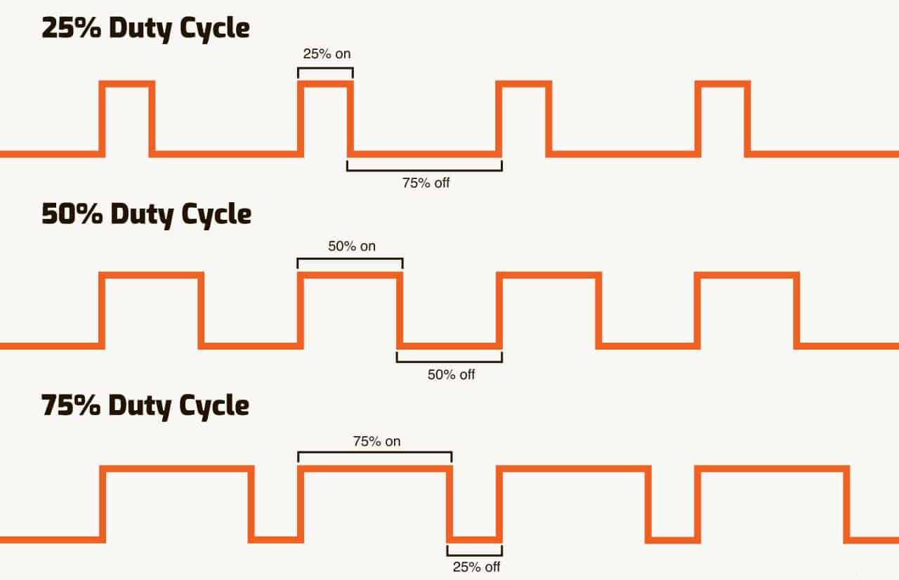
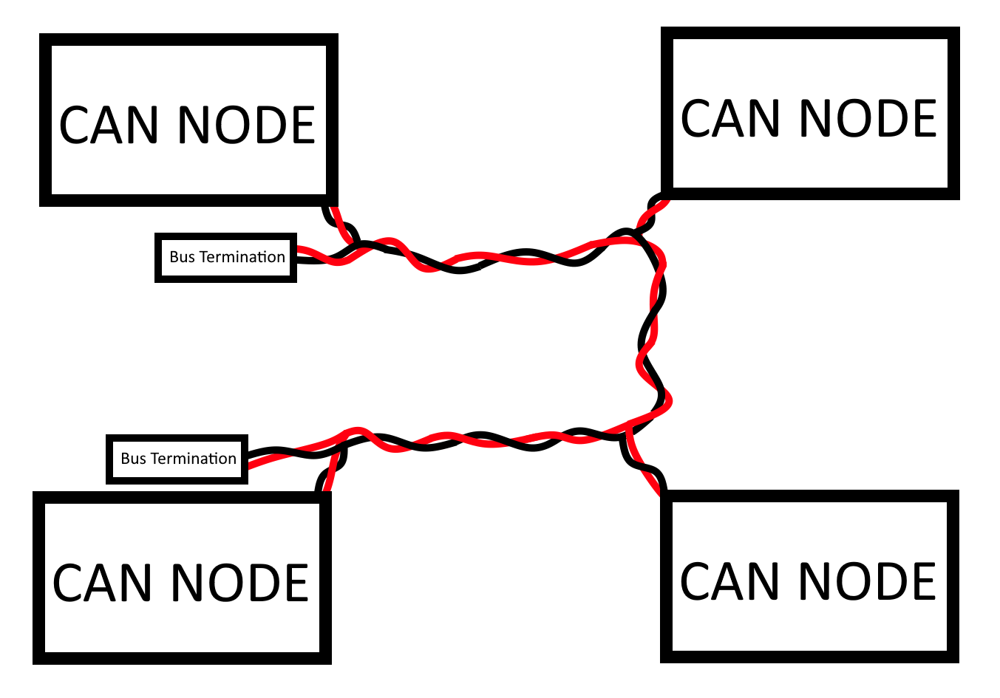

# Protocols - Week 2

## Pins

On our board, the nucleo, we have several pins designated, and broken out on our custom PCB for specific protocols and things.

With microcontrollers like our nucleo and the arduino, specific pins can be used for specific purposes. For example, as you can see in the diagram above, the top-left most pin, PC_10, can be used for SPI3_SCK and UART3_TX, we use it for UART3_TX, to communicate with the referee system.

# PWM (Pulse Width Modulation)

PWM is a type of protocol used with binary digital signals. It is used to simulate an analog output with a digital. We simply control how long the signal is high. You may see similarities to Exercise 2 from last week. 

The duty cycle of a PWM is the data you are sending, in the form of a percentage high.

In fact, you've already done a very simple PWM. Exercise 2 from Week 1 was a very basic PWM signal generator controlling the LED. 

PWM is used to control servos and some motors, but we specifically don't use PWM anymore, as we have switched to all CAN control for the motors we use.

# Serial (UART)

Serial, or UART, is a dual pin protocol that operates on a pre-defined clock. You will sometimes use one data pin however, as one is TX (transmitting), and one is RX (recieving). You will not always need to both transmit and recieve. For example, with the radio we use, we only recieve data, so we don't have a TX pin for that. 

#### Baud

The baud rate specifies how fast data is sent over a serial line. It's usually expressed in units of bits-per-second (bps). One of the most default baud rates is 9600, and another one that is used often is 115200, but bauds can be anything, as long as its consistent.

Baud matters VERY MUCH. If you have inconsistent Baud rates, that means that you're sending at a different rate than the reciever is recieving, so your data will look very very different.

| Clock                 | 1   | 2   | 3   | 4   | 5   | 6   | 7   | 8   | 9   | 10  | 11  | 12  | 13  | 14  | 15  | 16  | 17  | 18  | 19  | 20  | 21  | 22  | 23  | 24  | Message |
| --------------------- | --- |:--- | --- | --- | --- | --- | --- | --- | --- | --- | --- | --- | --- | --- | --- | --- | --- | --- | --- | --- | --- | --- | --- | --- | ------- |
| Sending - Baud 2000   | 0   | 1   | 0   | 0   | 1   | 0   | 0   | 0   | 0   | 1   | 1   | 0   | 1   | 0   | 0   | 1   | 0   | 0   | 1   | 0   | 0   | 0   | 0   | 1   | Hi!     |
| Recieving - Baud 1000 | 0   |     | 0   |     | 1   |     | 0   |     | 0   |     | 1   |     | 1   |     | 0   |     | 0   |     | 1   |     | 0   |     | 0   |     | d?      |

In this example, we are attempting to send the message "Hi!"
With the recieving baud as only half of the sending baud, we only actually capture the first half of of the bits, so the message we get is a lowercase d, and then the message ends with an incomplete four bits at the end

This is an very common way that we've had issues in the past, if we have baud's even slightly off, you can very quickly desync the clocks and begin getting pure garbage. We had an issue for a month where we had a baud of 115200 that instead should have been 100000. We had data that was so close to being good but was simply unusable.

This link will describe the intricacies of the [Serial Protocol in detail](serial.md) , if you'd like to learn more about the specifics of the protocol and what a packet consists of.

One thing to keep in mind is that in use, the TX of one endpoint is the RX of the other.

# Exercise #1

Take the starter code given in . 
A number of helper functions have been given to you, such as 

- **putc** (put a character into the output stream)

- **letterToNumber** (given a letter, returns its corresponding index in the alphabet) 

- **letterToNumber** (given an index in the alphabet, returns the corresponding letter)
  
  `a` is `0`, `b` is `1`, all the way to `z` being `25`.

Your task is to implement a simple, lowercase only caesar cipher, the input string has been given at the top, and using that and any of the functions given *and any more you may want to construct*, simply print out the message, shifted one forward (a becomes b, b becomes c, h becomes i, etc.)

**KEY THING TO REMEMBER**, remember that using putc or printf, nothing will show unless you have a newline at the end, thats what flushes the internal buffer to the screen. Without a newline, nothing will print.

# CAN (Controller Area Network)

Can is a unique communication protocol in that it is made for a large number of devices to all be connected in parallel, and is made for distance and minimal interference, provided that it is set up correctly.

For each device, the data in a frame is transmitted serially but in such a way that if more than one device transmits at the same time, transmission delay is employed to ensure that every node receives the data.

Data frames are received by all devices, including by the transmitting device.

#### CAN Wiring Diagram

Here, we can see that we have multiple nodes connected in parallel to one bus. There are two wires of importance here, the CAN high (RED) and CAN low (BLACK).

#### CAN Overall Concept

The easiest way to express can is the analogy of a mailbox.

The key feature of CAN is that each message packet contains more than just data, it comes with an adress as well.

Lets say we have 4 people living in a home, Alice, Bob, Carol, and Dan.

The CAN line delivers the mail to the home, and while all four recieve the mail, the respective inhabitants will only act on the mail that is relevant to them.
Lets say we have 5 packets coming in, as such

| Address | Message  | Content |
| ------- | -------- | ------- |
| 0x20a   | 00101000 | 40      |
| 0x20b   | 10111010 | -70     |
| 0x20a   | 00001010 | 10      |
| 0x20c   | 11111011 | -5      |
| 0x200   | 10101000 | -88     |

Each packet is adressed to a specific person. Alice reads the messages adressed to 0x20a, Bob the messages adressed to 0x20b, and so on. Alice has two messages, Bob has one, Carol has one message, and the final message is adressed so 0x200, which in this case, applies to all of them. Depending on how you write your code, it could also apply to none of them. Ultimately, the people (Nodes) determine whether or not a message applies to them, and what to do with that.

An example that is more specific to our robots and our situation. All the motors we use send constant feedback messages to our main board in the format as such:
The address is `0x200 + id of the motor`, so motor 1 will send on `0x201`, motor 5 on `0x205`, and motor 11 on `0x20b`.

| Address | Byte 1   | Byte 2   | Byte 3   | Byte 4   | Byte 5   | Byte 6   | Byte 7   |
| ------- | -------- | -------- | -------- | -------- | -------- | -------- | -------- |
| 0x201   | 00010100 | 00010100 | 11111111 | 11000100 | 00000000 | 01010000 | 00100010 |

Each message contains 7 bytes of importance, paired up into 4 16-bit integers. Above you can see an example message, and below is how the bits pair up importantly.

| Address | Byte 1+2      (ANGLE) | Byte 3+4 (VELOCITY) | Byte 5+6    (TORQUE_CURRENT) | Byte 7 (TEMPERATURE) |
| ------- | --------------------- | ------------------- | ---------------------------- | -------------------- |
| 0x201   | 00010100_00010100     | 11111111_11000100   | 00000000_01010000            | 00100010             |
|         | 5140 ticks            | -60 RPM             | 80                           | 34C                  |
